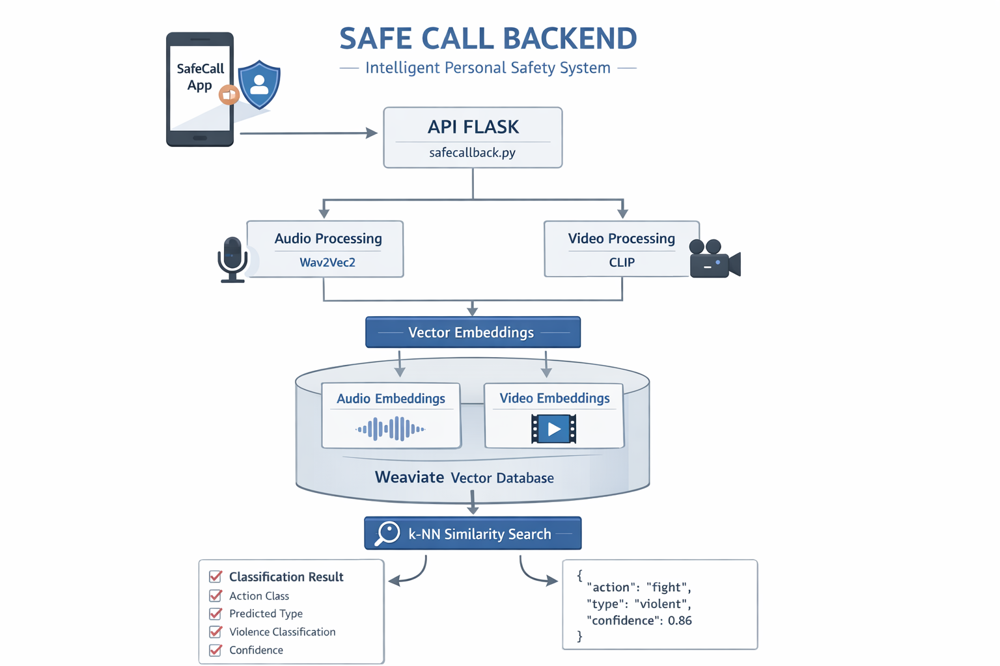
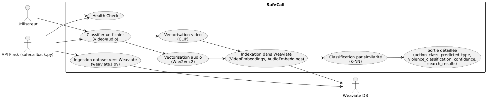

#  SafeCall 

<p align="center">
  
</p>

<p align="center">
  
  
  
  
  
</p>

---

##  Présentation

**SafeCall** est une API intelligente qui analyse des vidéos et audios afin de détecter automatiquement des situations critiques comme la violence ou les urgences médicales.

---

##  Use Case

<p align="center">
  
</p>

Le système suit ce flux :

-  L’utilisateur envoie une vidéo ou un audio
-  Le backend analyse le contenu
-  Recherche de similarité dans la base
-  Classification intelligente
-  Retour du résultat avec un score de confiance

---

##  Architecture détaillée

<p align="center">
  
</p>

###  Pipeline complet

1. **Entrée**
   - Vidéo / audio uploadé via API

2. **Extraction**
   - Audio → Wav2Vec2
   - Vidéo → CLIP

3. **Vectorisation**
   - Transformation en embeddings

4. **Stockage**
   - Weaviate
   - `VideoEmbeddings`
   - `AudioEmbeddings`

5. **Recherche**
   - Similarité (k-NN)
   - Comparaison avec données existantes

6. **Classification**
   - violent / non violent
   - type d’action

7. **Sortie**
   - Résultat JSON avec confidence

---

##  Stack technique

- Python
- Flask
- PyTorch
- CLIP
- Wav2Vec2
- Weaviate
- Docker
- ffmpeg

---

##  Installation

```bash
pip install -r requirement.txt
 Lancement
docker-compose up -d
python weaviate1.py
python safecallback.py
 Health check
curl.exe "http://localhost:5000/health"
Classification
curl.exe -X POST "http://localhost:5000/classify-action" -F "file=@video.mp4"
 Exemple de réponse
 {
  "success": true,
  "file": "exemple.mp4",
  "action_class": "fight",
  "predicted_type": "violent",
  "confidence": 0.86,
  "search_results": [
    {
      "similarity": 0.86,
      "distance": 0.15
    }
  ]
}
 Analyse par similarité

Le système fonctionne avec une logique vectorielle :

🟢 Forte similarité → confiance élevée
🟡 Moyenne → incertitude
🔴 Faible → faible confiance

 Plus la distance est faible, plus le cas est similaire.

📝 Notes
Le premier appel peut être lent (chargement des modèles)
GPU recommandé pour accélérer les calculs
Les fichiers uploadés ne sont pas stockés dans la base
<p align="center"> ⚡ SafeCall — Analyse intelligente pour la sécurité en temps réel </p> ```
